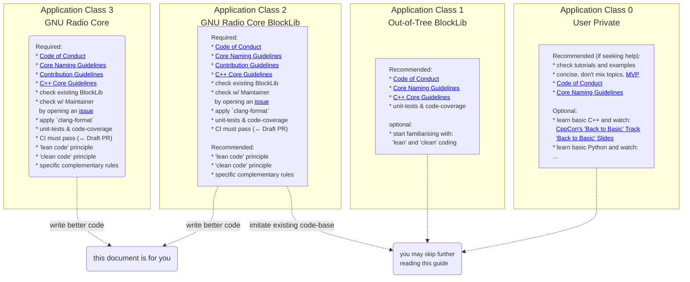

# Core Development Guidelines

### Preamble
Conway's Law [[1, 2]](#1) suggests that the structure of software reflects the communication patterns of the people who create it, 
influencing both the system's architecture and its progression. Just as a garden needs constant attention to thrive, our software
and community require ongoing care. Our goal is to foster a sustainable environment where GNU Radio and its creators can flourish, 
ensuring our systems are not only functional and efficient but also inviting and maintainable over the long term. Our core goals are:
  * **Core-Goal №1: Software must be fit-for-purpose and remain easily adaptable to changing requirements.**
    * specifically for GNU Radio: we want to write Software-Defined-Radio (SDR) applications that can be easily adapted to new functions (e.g. protocols, schemes, ...) on the same hardware.
  * **Core-Goal №2: be a friendly, empathetic and helpful person in writing software for other users**
  * **Core-Goal №3: write 'lean' and 'clean' software that follows established best-practise standards**

This document lays out the definitions and some of the more specific details in the hope to be both educative but also to create a common understanding of core developments goals we strive for.

### Target Audience
 We distinguish four application classes, which help determine the amount of rigor necessary in coding practice:
  * **Application Class 0**: *For those tinkering with GR and writing private user code:*
  * **Application Class 1**: *Developing Out-Of-Tree (OOT) Modules, Blocks, or Schedulers for others:*
  * **Application Class 2**: *Developing for GNU Radio Core BlockLib with long-term maintenance support interest (more than 2-3 years):*
  * **Application Class 3**: *Developing new features in the GNU Radio Core:*

More detail about this application classes can be seen in the graphic below and shown [here](#target-application-classes)
  

* This document is intended for maintainers, users that want to contribute to the core BlockLib, new Schedulers, or new features to the GNU Radio Core.
* These guidelines are a bit more formalised to promote sustainable coding practice and long-term maintainability of the project and require a bit of experience with modern C++.

### Introduction
Central to these guidelines are these fundamental questions: : **What constitutes 'lean' and 'clean' code, and how can we quantify and optimise it?** 

While 'clean code' and 'lean management' have sometimes devolved into buzzwords, their origins are rooted in:
  * **quantifiable metrics**: software must commit to quantifiable and actionable optimisation standards, beyond 'best practice' incantations.
  * **lean code**: originating from the [Toyota Production System](https://global.toyota/en/company/vision-and-philosophy/production-system/)
  ([wikipedia](https://en.wikipedia.org/wiki/Toyota_Production_System)), this philosophy focuses on streamlining processes, eliminating waste ([muda](https://en.wikipedia.org/wiki/Muda_(Japanese_term))), and enhancing value creation for both the organization and its users.
  * **clean code**: the principles laid out by Robert C. Martin, encapsulating best practices in programming for clarity and maintainability [[3, 4]](#3), 

**At its core: you cannot have one without the other.** establishing measurable 'lean' and 'clean' coding practices is essential 
for effective communication and organization within diverse teams  — comprising engineers, scientists, operators, and management — 
without compromising cost, efficiency, and our broader objectives.

Our goal is to establish principles and standards benefiting individual developers, teams, and management, ultimately improving the outcomes for all involved.

## Purposeful and Performance Metric Prioritising Coding

Striking a balance between ideal code and practical functionality is key. 'W.A.R.M.E.D' is a memorisation aid, inspired by
Casey Muratori's insights, that simplifies this into actionable steps. It focuses on producing robust, functional, and efficient
code without succumbing to over-engineering or speculative features. Each principle is associated with a 
metric to measure and optimise success:

1. **Write** code that directly addresses tangible, real-world problems. Embrace simplicity and avoid adding complexity that
   isn’t necessary. In a professional context, use Story Points (SP) as an aid to estimate task complexity beforehand and track actual effort post-completion.
   Ideally, keep tasks within a manageable scope of less than 5 SP, which aligns with a typical workweek, to promote efficiency and maintain focus.
   This also facilitates task handover, ensuring others can seamlessly continue the work -- if needed.
   Do not exceed 10 SP to prevent overcommitment, potentially block progress of others, and to keep the workload balanced and collaborative.
   metric: Story Points (SP)

2. **Agree** to well-established, field-tested designs with empirical backing, discarding unsupported unquantifiable ideas.
   Focus discussions on tackling substantive challenges rather than unnecessary divergence into trivial details, known as [bike-shedding](https://en.wikipedia.org/wiki/Law_of_triviality).
   Instead of prolonged design speculation, quick, benchmarked proofs of concept are preferred, acknowledging that only one, or perhaps none, may succeed. 
   metric: time/SPs spent on design discussions

3. **Readable** code should be well-written prose, with each line and function mirroring the clarity and conciseness
   of a sentence in a technical publication. Aim to reduce the source lines of code [[5-7]](#5) (e.g. using the 
   [COCOMO model](https://en.wikipedia.org/wiki/COCOMO)), which streamlines the codebase and simplifies long-term maintenance.
   metric: source lines of code (SLOC)s

4. **Modify** and add new features or expand APIs only when there is a clear and present need. Refrain from incorporating 
   enhancements for hypothetical scenarios; "add it later" should a component become essential. This not only avoids unnecessary bloat 
   but the simplicity of "adding it later" is also a litmus test to assess whether the software is composable, clean and lean.
   metric: Story Points (SP)

5. **Execute with Efficiency**: prioritise performance and reliability from the outset. Optimisation must be grounded in actual micro- 
   and macro benchmarks and validated through complementary functional (unit-)testing.
   metric (application specific): e.g. throughput, latency, jitter, CPU usage, power consumption

6. **Debug Strategically & use appropriate Tools**: tackle uncommon corner-cases and outliers at the end. Static code analysis tools (linters),
   AI-based generative tools, and compilers are typically more proficient than humans at optimising problems on a small to medium scale.
   Thus shift your attention from micro- to addressing broader, macro-level optimisations, complex algorithms, and architectural designs
   that are beyond the capability of those tools. metric (beyond SPs): e.g. test coverage percentages

Each step comes with inherent costs: time for development, time for arguments, time for SLOCs to read and modify, time for execution, 
time to debug extraneous API and rare corner cases. Avoid the temptation of feature creep and premature optimisations. 
Instead, weigh the 80/20 cost-benefit, focus on areas with the most value, and engage in continuous improvement. 
This approach ensures resources are invested in aspects with the highest return on investment providing the 'biggest bang for the buck'.

## Specific Development Guidelines

These specific guidelines complement the [C++ Core Guidelines](https://isocpp.github.io/CppCoreGuidelines/CppCoreGuidelines), providing direction in cases where there are multiple 
coding approaches, that are not (yet) standardised, or slightly deviate from standard practices.

  0. **Apply Common Sense, pay-it-forward, and the Golden Rule**
   ... for those with doubts, please read and adhere to the [Code of Conduct](CODE_OF_CONDUCT.md) and [Contribution Guidelines](CONTRIBUTING.md). 
  For most this is common sense and a minimum bit of required legalese to protect you, the community,
  to keep the project clean, and above board w.r.t. national and international laws.

1. **Best Clean- & Lean-Code Practices and the Boy-Scout Rule**
   - Adhere to the [C++ Core Guidelines](https://isocpp.github.io/CppCoreGuidelines/CppCoreGuidelines) as your primary reference.
   - Embrace the **Boy Scout Rule**: *Leave the code cleaner and leaner than you found it.*
   - Engage in continuous learning and practice of clean and lean coding. It's like a sport: *use it or lose it*.

2. **Tool Mastery**: *"If your only tool is a hammer, all problems appear as nails."*
   - Avoid committing code that triggers compiler warnings. `-Werror` may be activated turning warnings into an instant CI quality assurance fail.
   - Leverage linters and static code analysis tools, like SonarQube, that uphold minimum as well as best-practise coding standards.
   - Explore AI-based tools for code quality enhancement where appropriate.
   - Prioritise clarity over complexity: strive for code that's easy to read, efficient, and maintainable. 
     You do not have to demonstrate the sophistication of your (meta-)programming capabilities, we just assume you are a good programmer.
   - Automate code formatting with tools like `clang-format`. It is advisable to set up your IDE to run `clang-format` on save, 
     or to define a git hook that checks the formatting on commit.

*Important Note: Non-compliance will lead to CI rejection of the merge request
and often reduces the likeliness of someone reviewing your high-level code concepts. It's like applying a spell and grammar
checker to your e-mails ... they are free and easy to use ... just use them.*

3. **Coding Best Practices**:
   - Minimise variable scope and delay definitions until usage.
   - Use `using` and `using namespace` sparingly and within limited scope.
   - Avoid variable shadowing; opt for unique expressive names.
   - Avoid `bool` function arguments in APIs -- they are often ambiguous and confusing.
   - Create functions that are concise and focused, balancing the need to minimise complexity and length (SLOCs)
     while avoiding an excessive number of minor, hard-to-manage functions.

4. **The one C++ Standard**:
   - Use the latest C++ standard adopted by the project, considering the common denominator supported by CI's stable versions of GCC, Clang, and Emscripten.
   - Capitalise on the Standard Template Library (STL, (std)libc++). Opt for `<algorithm>`, `<numeric>`, `<ranges>`, etc., over custom solutions.
   - Favour `concepts` over `static_assert` for broader compile-time checks.

5. **Minimise 3rd-Party Library Dependencies**: except in the following cases:
   - they are crucial for core functionality (e.g. ZeroMQ or OpenSSL for network communication) or are on the C++ future features roadmap (such as refl-cpp and fmt).
   - Small libraries that can be internalised within the project are exceptions.
   - They are pre-agreed upon, only used in a sub-project, and can be conditionally disabled

6. **Effective Testing and Documentation:**
   - Ensure functional unit testing and meaningful code coverage.
   - Use `static_assert`s for compile-time verifications.
   - Provide usage examples to illustrate the library's simplified common core use alongside unit-tests that need to handle more complex and less common corner cases.
   - Accept both test-driven and example-driven development for API design.

7. **Naming Convention**: Please read and follow the [naming guidelines](https://github.com/fair-acc/graph-prototype/blob/main/CORE_NAMING_GUIDELINE.md).

8. **Structs vs Classes**: strongly prioritise functional programming where possible to mitigate performance bottlenecks
   and race conditions, especially in multi-threaded environments.
   - Favour public `structs` (aka. *aggregates*) over `classes` unless encapsulation of a non-public invariant or shared state (e.g. a HW resource) is required.
   - Prefix member variables that have a predominantly 'private' use-case with an underscore (_).
   - structure members should be defined in the following order if possible:
     1. Meta-information about the structure/class (`static_assert`s that check compile-time properties of the type such as checking template parameters are valid in class templates);
     2. Member variables that define the private and public state.
     3. Public member functions;
     4. Protected member functions;
     5. Private member functions.

9. **Header-only Code**: prefer writing header-only code
   - Prefer header-only code for better optimisation, despite slower compilation.
   - Use `const` and `constexpr` liberally, except when they impede performance (e.g. 'const' disabling move semantics).

10. **Contemporary C++ Practices:**
    - Don't overuse and reserve the use of `auto` where it enhances readability or is required.
    - Raw pointers
      - should be limited to specific use cases, must be non-owning, and marked as unsafe when outside those parameters.
      - prefer wrapping them into a RAII-enabled types.
      - are fine if they are used without pointer arithmetic
    - Pass by value or reference-to-const based on the data type size and context.
    - Exceptions should remain exceptional. Opt for alternatives like `std::conditional<>` or `std::expected<>` for simpler stacks.
    - **[Inheritance Is The Base Class of Evil](https://www.youtube.com/watch?v=bIhUE5uUFOA)**:
      strongly favour composition over inheritance. Avoid the latter unless RTTI is absolutely necessary.
      *N.B. This has a strong impact on the long-term evolution and maintainability of the project.
      Strongly Object-Oriented-Designs with prolific inheritance hierarchy make it difficult to near impossible to change designs without breaking existing code.*  
    - Use contemporary C++ features like enum classes, `override`, and `final` where appropriate.

## [Resources for Further Learning]
  * <a id="1">[1]</a> Melvin E. Conway: *"How Do Committees Invent?"*. In: Datamation (1968) ([pdf](https://git.gsi.de/SDE/cxx-user-group/uploads/ba3fa2eddd700e7b50e89564c6ec0f70/Conway__Melvin_E.__How_Do_Committees_Invent_._In__Datamation__1968_.pdf))
  * <a id="2">[2]</a> Casey Muratori, *"Lecture: The Only Unbreakable Law"*, ([55" video](https://youtu.be/5IUj1EZwpJY) + [summary](https://git.gsi.de/SDE/cxx-user-group/-/issues/40))
  * <a id="3">[3]</a> Robert C. Martin, *"Clean Code: A Handbook of Agile Software Craftsmanship"*, Prentice Hall; 1st edition (1 Aug. 2008), 464 pp. ([link](https://www.amazon.de/-/en/Robert-Martin/dp/0132350882), [12" summary video](https://youtu.be/RAr4-MD10pQ), [TL;DR Summary](#clean_code))
  * <a id="4">[4]</a> Robert C. Martin, Lecture Series: *"Coding Better World Together"*, UnityCoin, 2019 ([Lecture №1, 1'50"](https://youtu.be/7EmboKQH8lM), [№2, 1'06"](https://youtu.be/2a_ytyt9sf8), [№3, 60"](https://youtu.be/Qjywrq2gM8o), [№4, 1'30"](https://youtu.be/58jGpV2Cg50), [№5, 2'](https://youtu.be/sn0aFEMVTpA), [№6, 1'40"](https://youtu.be/l-gF0vDhJVI))
  * <a id="5">[5]</a> Donald J. Reifer, Barry W. Boehm, and Sunita Chulani. *“The Rosetta Stone Making COCOMO 81 Estimates Work with COCOMO II.”* (1999). ([paper](https://api.semanticscholar.org/CorpusID:14499705)))
  * <a id="6">[6]</a> Jairus Hihn Lum, Mori Khorrami, *"Handbook for Software Cost Estimation"*, Jet Propulsion Laboratory, Pasadena, California, 2000, ([paper](https://www.academia.edu/19060864/Handbook_for_Software_Cost_Estimation))
  * <a id="7">[7]</a> David A. Wheeler, *"SLOCCount"*, 2001-2004, https://dwheeler.com/sloccount/
  * <a id="8">[8]</a> Sean Parent, *"Inheritance Is The Base Class of Evil"*, GoingNative 2013 Event, 23 Sept 2013, ([talk 25"](https://www.youtube.com/watch?v=bIhUE5uUFOA))

## Appendix

### Target Application Classes

  * **Application Class 0**: *For those tinkering with GR and writing private user code:*
    * Choose your style, conventions, rules, and guidelines that fit you best.
    * As a *recommendation* when seeking for help to get better support and high-quality feedback:
      * Check tutorials and examples for existing solutions.
      * Be concise in problem descriptions, avoid unrelated topics, and provide a minimum viable example ([MVP](https://en.wikipedia.org/wiki/Minimum_viable_product)) 
      * Adhere to the [Code of Conduct](CODE_OF_CONDUCT.md) and be courteous – most GNU Radio helpers are volunteers.
      * Use the [Core Naming Guidelines](CORE_NAMING_GUIDELINE.md)  for easier code readability and problem recognition.
    * Optionally: take a bit of your time to improve basic C++ or learn modern C++ coding practices. It's worth the investment, it's efficient, simpler than before, and fun. Recommended resources: 
      * Lecture series (choose based on style and preference **!!selection & curation needed!!**):
         * [The Cherno: C++ Course (free)](https://www.youtube.com/playlist?list=PLlrATfBNZ98dudnM48yfGUldqGD0S4FFb)
         * [Codedamn: From Novice to Expert: Mastering C++ Programming (free)](https://codedamn.com/learn/cpp-language)
         * [Udemy: The C++20 Masterclass: From Fundamentals to Advanced (paid)](https://www.udemy.com/course/the-modern-cpp-20-masterclass/)
         * [Kate Gregory: C++20 Fundamentals (paid)](https://www.pluralsight.com/courses/cplusplus-20-fundamentals)
         * [Udemy: Beginning C++ Programming - From Beginner to Beyond (paid)](https://www.udemy.com/course/beginning-c-plus-plus-programming/)
         * [Codecademy: Learn C++ (paid)](https://www.codecademy.com/learn/learn-c-plus-plus)
         * [The Great Courses: Introduction to C++: Programming Concepts and Applications (paid)](https://www.thegreatcourses.com/courses/introduction-to-c-plus-plus-programming-concepts-and-applications)
      * Building upon that: 
        * [CppCon](https://cppcon.org/)'s ['Back to Basic' Track](https://www.youtube.com/watch?v=Bt3zcJZIalk&list=PLHTh1InhhwT4TJaHBVWzvBOYhp27UO7mI&pp=iAQB) and [Slides](https://github.com/CppCon/CppCon2023).
        * YouTube Channels: [C++ Weekly](https://www.youtube.com/@cppweekly), [The Cherno](https://www.youtube.com/@TheCherno), [Casey Muratori's channel](https://www.youtube.com/@MollyRocket)
[//]: # (    * if you do not plan to make your code public you could stop here, otherwise you may continue.)
  * **Application Class 1**: *Developing Out-Of-Tree (OOT) Modules, Blocks, or Schedulers for others:*
    * As above, plus:
        * Familiarise with the [C++ Core Guidelines](https://isocpp.github.io/CppCoreGuidelines/CppCoreGuidelines) for safe syntax in modern C++.
        * Optionally, learn 'lean' and 'clean' coding principles outlined below.
  * **Application Class 2**: *Developing for GNU Radio Core BlockLib with long-term maintenance support interest (more than 2-3 years):*
    * Adhere to the [Code of Conduct](CODE_OF_CONDUCT.md), [Core Naming Guidelines](CORE_NAMING_GUIDELINE.md), [Contribution Guidelines](CONTRIBUTING.md) and [C++ Core Guidelines](https://isocpp.github.io/CppCoreGuidelines/CppCoreGuidelines) 
    * Before starting developing a new block, check with the existing BlockLib consult core maintainers via the GH [issue tracker](./issues), and
      1. that there isn't already an existing implementation of the feature that you need, or 
      2. that could be achieved through combining existing blocks (GR 4.0 compile-time merging capabilities offer these for free), and 
      3. pick a template or existing block that you like and/or is closest to what you want to achieve, and
      4.where to place the new functionality/implementation in the BlockLib.
    * Ensure that your code **passes all CI tests** (e.g. through opening a 'draft pull-request'), that it does not generate extra compiler warning, and uses the provided '**clang-format**' definition.  
  * **Application Class 3**: *Developing new features in the GNU Radio Core:*
    * This document is intended for maintainers, users that want to contribute to the core BlockLib, new Schedulers, or new features to the GNU Radio Core.
    * These guidelines are a bit more formalised to promote sustainable coding practice and long-term maintainability of the project and require a bit of experience with modern C++.

### 'Lean Management' TL;DR Summary:

Lean management advocates the optimisation of processes and value by conserving resources and reducing unnecessary effort, time, and expense, whether in product development, service delivery, or R&D processes.
It is based on a clear understanding of what brings value to the organisation and its users. The methodology encourages the minimisation of waste ([muda](https://en.wikipedia.org/wiki/Muda_(Japanese_term)), anything that doesn't contribute to value), inconsistency ([mura](https://en.wikipedia.org/wiki/Mura_(Japanese_term)), wasting of time or resources), and overburden ([muri](https://en.wikipedia.org/wiki/Muri_(Japanese_term)), *"unreasonableness; impossible; beyond one's power; too difficult; by force; perforce; forcibly; compulsorily; excessiveness; immoderation"*).

#### General Principles of Lean Management:

1. **Identify Value**: start with understanding the stakeholders' needs. Value is what attracts and retains users and fulfils the organisation's objectives. It should be at the heart of every decision made.

2. **Map the Value Stream**: recognise all critical steps involved in the process from inception to delivery (i.e. the full vertical stack). Critically identify areas that do not contribute to the end goals and devise ways to minimise or eliminate such inefficiencies.

3. **Create Flow**: stream-line all processes and operations, reducing bottlenecks and delays. This encourages seamless transition of tasks and a smooth workflow, which is crucial for maintaining timelines and quality in product development, services, and R&D processes.

4. **Establish Pull**: align output with short-term, medium-term to long-term demand in decreasing priority, creating a system that responds to actual needs rather than projected ones alone.

5. **Pursue Perfection**: commit to continuous improvement. This iterative approach means always looking for ways to refine processes, increase efficiency, and enhance value creation, regardless of the field or sector.

6. **Respect for People**: build a collaborative environment where team members, partners, and all stakeholders are valued and engaged. A respectful workplace leads to a more dedicated team, fostering innovation and proactive problem-solving. Software mirrors the organisational culture and how people interact with each other.

[//]:
### 'Clean Code' TL;DR summary of Robert C. Martin's book ([source](https://gist.github.com/wojteklu/73c6914cc446146b8b533c0988cf8d29)):

Code is clean if it can be understood easily – by everyone on the team. Clean code can be read and enhanced by a developer 
other than its original author. With understandability comes readability, changeability, extensibility and maintainability.

  
Click for more ...

### General rules
1. Follow standard conventions.
2. Keep it simple stupid. Simpler is always better. Reduce complexity as much as possible.
3. Boy scout rule. Leave the campground cleaner than you found it.
4. Always find root cause. Always look for the root cause of a problem.

### Design rules
1. Keep configurable data at high levels.
2. ~~Prefer polymorphism to if/else or switch/case.~~ -> *N.B. [Inheritance Is The Base Class of Evil](https://www.youtube.com/watch?v=bIhUE5uUFOA) *
3. ~~Separate multi-threading code.~~ -> *N.B. we follow a functional programming style that minimise hidden state for thread-safety and performance reason*
4. Prevent over-configurability.
5. Use dependency injection.
6. Follow Law of Demeter. A class should know only its direct dependencies.

### Understandability tips
1. Be consistent. If you do something a certain way, do all similar things in the same way.
2. Use explanatory variables.
3. Encapsulate boundary conditions. Boundary conditions are hard to keep track of. Put the processing for them in one place.
4. Prefer dedicated value objects to primitive type.
5. Avoid logical dependency. Don't write methods which works correctly depending on something else in the same class.
6. Avoid negative conditionals.

### Names rules
1. Choose descriptive and unambiguous names.
2. Make meaningful distinction.
3. Use pronounceable names.
4. Use searchable names.
5. Replace magic numbers with named constants.
6. Avoid encodings. Don't append prefixes or type information.

### Functions rules
1. Small.
2. Do one thing.
3. Use descriptive names.
4. Prefer fewer arguments.
5. Have no side effects.
6. Don't use flag arguments. Split method into several independent methods that can be called from the client without the flag.

### Comments rules
1. Always try to explain yourself in code.
2. Don't be redundant.
3. Don't add obvious noise.
4. Don't use closing brace comments.
5. Don't comment out code. Just remove.
6. Use as explanation of intent.
7. Use as clarification of code.
8. Use as warning of consequences.

### Source code structure
1. Separate concepts vertically.
2. Related code should appear vertically dense.
3. Declare variables close to their usage.
4. Dependent functions should be close.
5. Similar functions should be close.
6. Place functions in the downward direction.
7. Keep lines short.
8. Don't use horizontal alignment.
9. Use white space to associate related things and disassociate weakly related.
10. Don't break indentation.

### Objects and data structures
1. ~~Hide internal structure.~~ -> *N.B. prefix internal/private variables with `_` and only 'hide' if RAII dictates or absolute necessary.*
2. Prefer data structures.
3. Avoid hybrids structures (half object and half data).
4. Should be small.
5. Do one thing.
6. Small number of instance variables.
7. ~~Base class should know nothing about their derivatives.~~ -> *N.B. we frequently use the [CRTP pattern](https://en.wikipedia.org/wiki/Curiously_recurring_template_pattern) to avoid inheritance and vtables.*
8. ~~Better to have many functions than to pass some code into a function to select a behaviour.~~ -> *N.B. small functions are good but also need to limit the level of indication because too many functions increase the cognitive load for readers and also limit compiler optimisation.*
9. Prefer non-static methods to static methods.

### Tests
1. One assert per test.
2. Readable.
3. Fast.
4. Independent.
5. Repeatable.

### Code smells
1. Rigidity. The software is difficult to change. A small change causes a cascade of subsequent changes.
2. Fragility. The software breaks in many places due to a single change.
3. Immobility. You cannot reuse parts of the code in other projects because of involved risks and high effort.
4. Needless Complexity.
5. Needless Repetition.
6. Opacity. The code is hard to understand.

[//]:

