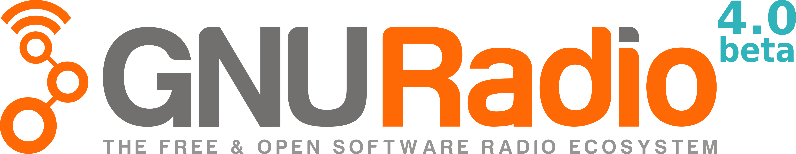

<p align="center">

</p>

[](https://opensource.org/licenses/LGPL-3.0)
 <!-- ALL-CONTRIBUTORS-BADGE:START - Do not remove or modify this section -->
[](#contributors-)
<!-- ALL-CONTRIBUTORS-BADGE:END -->

# GNU Radio 4.0 prototype

> [!IMPORTANT]
> This is the GNU Radio 4.0 (GR4) prototype and is currently in a beta state. For production use,
> please use the GNU Radio 3.X (GR3) version found [here](https://github.com/gnuradio/gnuradio).
> Bug reports related to this beta should be submitted [here](https://github.com/fair-acc/gnuradio4/issues),
> and bug reports for GNU Radio 3.X should be submitted [here](https://github.com/gnuradio/gnuradio/issues)

GNU Radio is a free & open-source signal processing runtime and signal processing
software development toolkit. Originally developed for use with software-defined
radios and for simulating wireless communications, it's robust capabilities have
led to adoption in hobbyist, academic, and commercial environments. GNU Radio has
found use in software-defined radio, digital communications, nuclear physics, high-
energy particle physics, astrophysics, radio astronomy and more!

## Building

GNU Radio 4.0 uses modern C++ (C++23), and is tested for

- CMake (>= 3.25),
- GCC (>=13.3, better: >=14.2)
- Clang (>=18, recommended), and
- Emscripten (3.1.66).

**To build**:

```bash
git clone https://github.com/gnuradio/gnuradio4.git
cd gnuradio4

# (Optional) If you experience excessive gcc memory usage during builds (needs sudo):
sudo ./enableZRAM.sh

mkdir build && cd build
cmake -DCMAKE_BUILD_TYPE=RelWithAssert -DGR_ENABLE_BLOCK_REGISTRY=ON ..
cmake --build . -- -j$(nproc)
```

**Cleaning up zram** if used:

```bash
sudo swapoff /dev/zram0
echo 1 | sudo tee /sys/block/zram0/reset
```

### Key CMake Flags `-D...=<ON|OFF>`

- **`GR_ENABLE_BLOCK_REGISTRY`** (default: ON): enables a runtime registry of blocks.
  Turning this off gives fully static builds.
- **`EMBEDDED`** (default: OFF): reduces code size and runtime features for constrained systems.
  Also implicitly enabled by `-DCMAKE_BUILD_TYPE=MinSizeRel`.
- **`WARNINGS_AS_ERRORS`** (default: ON): treats all compiler warnings as errors (`-Werror`).
- **`TIMETRACE`** (default: OFF): activates Clang’s `-ftime-trace` for per-file compilation timing.
- **`ADDRESS_SANITIZER`** (default: OFF): enables AddressSanitizer (can’t be combined with the other sanitiser options).
- **`UB_SANITIZER`** (default: OFF): enables 'Undefined Behavior' checks.
- **`THREAD_SANITIZER`** (default: OFF): enables threading checks (N.B. strong impact on performance).

### Example Combined Command

```bash
cmake -B build -S . \
  -DCMAKE_BUILD_TYPE=RelWithAssert \
  -DGR_ENABLE_BLOCK_REGISTRY=ON \
  -DWARNINGS_AS_ERRORS=ON \
  -DTIMETRACE=OFF \
  -DADDRESS_SANITIZER=OFF \
  -DUB_SANITIZER=OFF \
  -DTHREAD_SANITIZER=OFF
cmake --build build -- -j$(nproc)
```

Feel free to tweak these flags based on your needs (embedded targets, debugging, sanitising, etc.).
For more details, see [DEVELOPMENT.md](DEVELOPMENT.md) or comments in the `CMakeLists.txt` file that
describe how to set up a local development environment.

## Helpful Links

- [GNU Radio Website](https://gnuradio.org)
- [GNU Radio Wiki](https://wiki.gnuradio.org/)
- [Github issue tracker for bug reports and feature requests](https://github.com/fair-acc/gnuradio4/issues)
- [View the GNU Radio Mailing List Archive](https://lists.gnu.org/archive/html/discuss-gnuradio/)
- [Subscribe to the GNU Radio Mailing List](https://lists.gnu.org/mailman/listinfo/discuss-gnuradio)
- [GNU Radio Chatroom on Matrix](https://chat.gnuradio.org/)
  - Specifically for discussions related to GNURadio 4.0 join the [#architecture channel](https://matrix.to/#/#architecture:gnuradio.org)
- [Contributors and Affiliated Organizations](https://github.com/gnuradio/gnuradio/blob/main/CONTRIBUTORS.md)

## What's New in GNU Radio 4.0?

- **Smooth Transition with Updated GR3 Paradigms**: User-defined blocks and flow-graphs continue to be accessible graphically, through Python, and using C++. Notable simplifications and streamlining have been made to the underlying low-level architecture and design, as described [here](https://github.com/fair-acc/gnuradio4/tree/main/core).
- **Enhanced Data Types**: Support for fundamental data types (i.e. ints, floats, complex numbers) as well as more complex, structured, and user-defined custom types.
- **Simplified Block Development**: Modern C++ and computing standards enable rapid development.
- **High-Performance Signal-Processing**: Significant performance boosts from lock-free buffers, compile-time optimisations, and built-in SIMD & SYCL support.
- **Flexible Scheduling**: An updated scheduling method improves performance and enables user-defined schedulers to balance throughput, parallelism, and latency depending on the application.
- **Recursive Directed Graphs**: Support for basic feedback loops.
- **Broadened Hardware Support**: Ready for CPUs, MCUs, GPUs, and aspirationally FPGAs.
- **Bridging R&D and Industrial Use**: Aims to bridge the gap between academics using GNU Radio for research, hobbyists using it for prototyping and safe operational use by research organizations and industry.

## License and Copyright

Unless otherwise noted: SPDX-License-Identifier: LGPL-3.0-linking-exception
All code contributions to GNU Radio will be integrated into a library under the LGPL, ensuring it remains free/libre (FLOSS) for both personal and commercial use, without further constraints on either.
For details on how to contribute, please consult: [CONTRIBUTING.md](CONTRIBUTING.md)

Copyright (C) 2001-September 2020 GNU Radio Project -- managed by Free Software Foundation, Inc.
Copyright (C) September 2020-2024 GNU Radio Project -- managed by SETI Institute
Copyright (C) 2018-2024 FAIR -- Facility for Antiproton & Ion Research, Darmstadt, Germany

## Acknowledgements

The GNU Radio project appreciates the contributions from FAIR in the co-development of GNU Radio 4.0. Their dedicated efforts have played a key role in enhancing the capabilities of our open-source SDR technology.
We would like to recognize the following contributors for their roles in redesigning the core that has evolved into GR 4.0:

## Contributors

Thanks goes to these wonderful people ([emoji key](https://allcontributors.org/docs/en/emoji-key)):

<!-- ALL-CONTRIBUTORS-LIST:START - Do not remove or modify this section -->
<!-- prettier-ignore-start -->
<!-- markdownlint-disable -->
<table>
  <tbody>
    <tr>
      <td align="center" valign="top" width="14.28%"><a href="https://github.com/wirew0rm"><br /><sub><b>Alexander Krimm</b></sub></a></td>
      <td align="center" valign="top" width="14.28%"><a href="https://github.com/cafeclimber"><br /><sub><b>Bailey Campbell</b></sub></a></td>
      <td align="center" valign="top" width="14.28%"><a href="https://github.com/chrisjohgorman"><br /><sub><b>Chris Gorman</b></sub></a></td>
      <td align="center" valign="top" width="14.28%"><a href="http://destevez.net"><br /><sub><b>Daniel Estévez</b></sub></a></td>
      <td align="center" valign="top" width="14.28%"><a href="https://github.com/dennisklein"><br /><sub><b>Dennis Klein</b></sub></a></td>
      <td align="center" valign="top" width="14.28%"><a href="https://github.com/frankosterfeld"><br /><sub><b>Frank Osterfeld</b></sub></a></td>
      <td align="center" valign="top" width="14.28%"><a href="http://cukic.co"><br /><sub><b>Ivan Čukić</b></sub></a></td>
    </tr>
    <tr>
      <td align="center" valign="top" width="14.28%"><a href="https://github.com/marcusmueller"><br /><sub><b>Marcus Müller</b></sub></a></td>
      <td align="center" valign="top" width="14.28%"><a href="https://mattkretz.github.io/"><br /><sub><b>Matthias Kretz</b></sub></a></td>
      <td align="center" valign="top" width="14.28%"><a href="https://github.com/eltos"><br /><sub><b>Philipp Niedermayer</b></sub></a></td>
      <td align="center" valign="top" width="14.28%"><a href="https://github.com/RalphSteinhagen"><br /><sub><b>Ralph J. Steinhagen</b></sub></a></td>
      <td align="center" valign="top" width="14.28%"><a href="https://github.com/iamsergio"><br /><sub><b>Sergio Martins</b></sub></a></td>
      <td align="center" valign="top" width="14.28%"><a href="https://github.com/flynn378"><br /><sub><b>Toby Flynn</b></sub></a></td>
      <td align="center" valign="top" width="14.28%"><a href="https://github.com/drslebedev"><br /><sub><b>drslebedev</b></sub></a></td>
    </tr>
    <tr>
      <td align="center" valign="top" width="14.28%"><a href="https://github.com/mormj"><br /><sub><b>mormj</b></sub></a></td>
    </tr>
  </tbody>
  <tfoot>
    <tr>
      <td align="center" size="13px" colspan="7">
        
          <a href="https://all-contributors.js.org/docs/en/bot/usage">Add your contributions</a>
        </img>
      </td>
    </tr>
  </tfoot>
</table>

<!-- markdownlint-restore -->
<!-- prettier-ignore-end -->

<!-- ALL-CONTRIBUTORS-LIST:END -->
