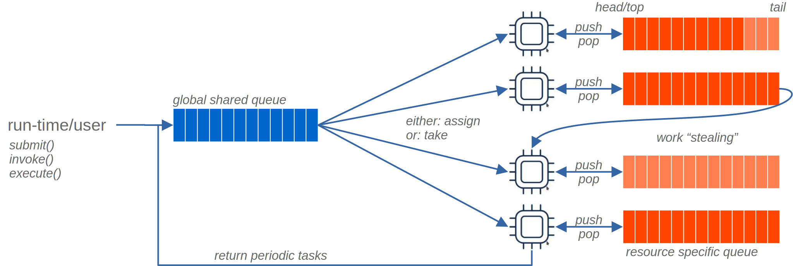
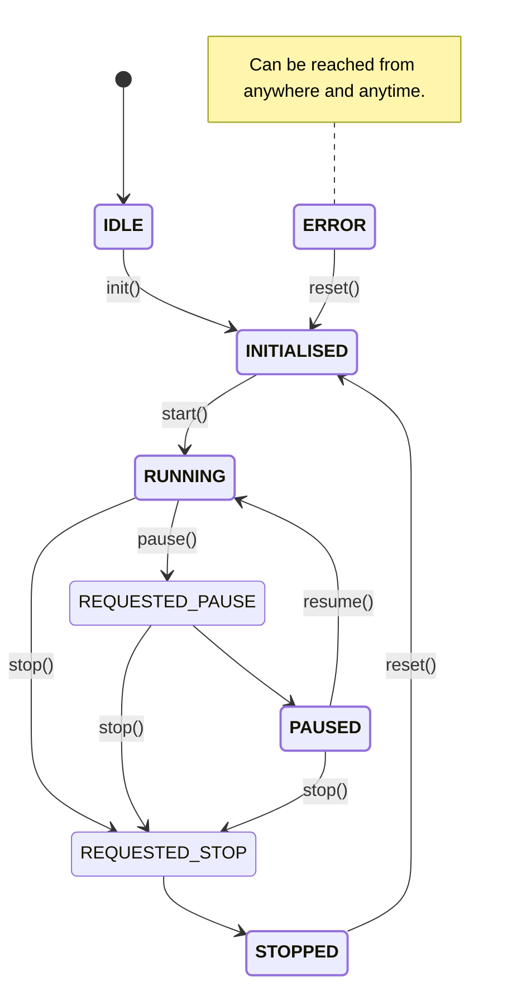

# Basic Graph Library Concepts and low-level API

The following is a brief introduction to the library architecture for people already vaguely familiar with GNU Radio,
graph-based algorithms, or those simply looking for a quick-intro intro of the concepts and the 'where-is-what
implemented'.
For the 'how-it-is-implemented' please consult the provided links, code-references, and feel welcome to make PRs to
continuously improve this document.

## Overall Architecture


* [(sub-) flow-graph](#Flow-Graph) refers to a collection of interconnected processing elements, often referred to as
  *blocks*, *nodes* or *vertices*, that perform signal processing operations on data. The graph represents the flow of
  data from one block to another, with blocks performing computations on the data at each step. Each graph may contain
  sub-flow-graphs. For the specific implementation, see [Graph.hpp](Graph.hpp).
* [Block/Node/Vertex](#Blocks) is a single processing element that performs a specific signal processing operation
  through a general `work()` function. Blocks are the building blocks of a flow-graph and can be thought of as vertices
  in a graph, and *ports* are their input/output connections to neighboring blocks for data streaming, streaming tags,
  and asynchronous messages. For the specific implementation, see [Block.hpp](Block.hpp).
* [Port](#Ports) is an interface through which data flows into or out of a block. Each block may have zero, one or
  more input ports, and zero, one or more output ports. Data is passed between blocks by connecting the output Port of
  one block to the input Port of another. For the specific implementation, see [port.hpp](port.hpp).
* [buffer](#Buffer)  is an area of memory where data is temporarily stored in the runtime-connected graph. Each Port
  has its own buffer to store the data, tags, or other messages it needs to perform its computations. Buffer
  implementations are typically domain-specific (e.g. for blocks/ports implemented on the CPU, GPU, etc.) and are often,
  but not necessarily, implemented as circular buffers. For the specific interface see [Buffer.hpp](Buffer.hpp) and one
  of the possible implementation, see [circular_buffer.hpp](circular_buffer.hpp).
* [scheduler](#Scheduler) manages the execution of blocks in a graph. It determines the ordering and resources for
  block execution based on constraints defined by the blocks or externally, to ensure smooth data flow from one block to
  another. As there is no one-size-fits-all scheduler implementation, multiple user-defined scheduler implementations
  may be associated with top-level and sub-graphs. For one possible specific implementation, see
  the `work_return_t work() {...}` in [Graph.hpp](Graph.hpp) for details.

  *N.B. this is an active area of development and will likely see further changes.*

### Flow-Graph

There is a current proposal [P1709](https://github.com/stdgraph/P1709) to include `std::graph` as part of the C++26
standard library. This proposal builds on the experiences gained from previous implementations like
[boost::graph](https://github.com/boostorg/graph) and [NWGraph](https://github.com/pnnl/NWGraph), and has been presented
at the CppCon'22 conference ([video](https://www.youtube.com/watch?v=jCnBFjkVuN0),
[slides](https://github.com/CppCon/CppCon2022/blob/main/Presentations/C-Phil-Ratzloff-CppCon-2022.pdf)).
The prototype implementation of the library is available for review [here](https://github.com/stdgraph/graph-v2).

This library implementation goes beyond the graph-vertex-edge functionality provided by `std::graph`, and focuses also
on the signal-processing related high-performance data-exchange between blocks, scheduling work of each block, and
highly-efficient signal-processing within each block.
Nevertheless, while the `std::graph` proposal is still work-in-progess, it is being used to inspire and develop a
clearer picture w.r.t. the design and relationship between the `graph` and `scheduler` classes to keep in line with
existing best-practices and -- once P1709 matured and reaches the level as C++ standard -- to retain the option to
switch and adopt the provided low-level graph algorithms.

### Ports

Ports in this framework are designed to interconnect blocks in a graph, similar to RF connectors. The Port class
template has several parameters that define its behaviour, including the type of data it handles (`T`), its
name (`PortName`), type (`PortType`), direction (`PortDirection` <-> input/output), and optional list of `Arguments`
that may constrain the port behaviour on the `Block` or `Scheduler` level::

```cpp
class template<typename T, fixed_string PortName, port_type_t PortType, port_direction_t PortDirection, typename... Arguments>
struct Port { /* ... */ };
```

Some of the possible optional port annotation attributes are:

* `RequiredSamples` to describe the min/max number of samples required from this port before invoking the blocks work
  function,
* `Optional` informing the graph/scheduler that a given port does not require to be connected,
* `PortDomain<fixed_string>` described whether the port can be handled within the same scheduling domain (e.g. `CPU`
  or `GPU`),
* `StreamBufferType` and `TagBufferType` to inject specific user-provided buffer implementations to the port, or
* `Async` for making a port asynchronous in a signal flow-graph block.

When connecting ports, either a single-step or a two-step connection method can be used:

1. single-step connection: which allocates a buffer and passes the corresponding `BufferWriter` and `BufferReader`
   instances to the source and destination Port. The buffer size is determined only once based on
   the `[MIN, MAX]_SAMPLES` constraints and is inherited/fixed for further connected input ports.
2. two-step connection (usually done by the graph):
    * register all ports that shall be connected to each other
    * determine the minimum buffer size required by the set of connected Port and then perform the actual connections as
      outlined in the single-step connection method.

Each Port belongs to a single computing domain, which is specified using the port_domain_t enumeration:

```cpp
enum class port_domain_t { CPU, GPU, NET, FPGA, DSP, MLU /*, ...*/ };
```

This is an important consideration, as transitions between domains need to be done explicitly using data conversion
blocks. This is to keep the buffer implementations simple, concise, and exchangeable within a given computing domain,
and to make the impact of data conversion on overall latency, throughput, and efficiency explicit to the user.

For example, when transitioning between CPU blocks, the buffers and MAX_SAMPLES may be kept small to favor low-latency
execution. On the other hand, when including GPUs, a block-transfer approach may be favored for maximum efficiency.
These choices can have a significant impact on performance, and it is important to make them explicit to the user.

For example: for transitions between CPU blocks one may opt to keep the buffers and `MAX_SAMPLES` very small to keep
favour low-latency execution (e.g. few bytes) to keep the data and L1/L2/L3 caches hot; At the same time, when
including, for example, GPUs this choice would cause significant overhead when copying data from the CPU to GPU that
favour DMA-type block-transfer to exchange data for best efficiency.

Additionally, the usage of one buffer type and Port per computation domain, along with explicit data conversion, enables
users to easily extend the framework. This approach provides the flexibility for users to define custom buffer and Port
implementations that cater to the specific requirements of their applications, thus offering optimal performance and
scalability. The ability to create specialized implementations for specific use cases, coupled with the framework's
openness to user-defined extensions, makes it a versatile and customizable solution.

### Blocks

*Blocks* interchangeably also referred to as *nodes* or *vertices* implement the specific signal processing operation
through implementing a generic `work_return_t work() {...}` function. The `Block<T>` is the base class for all
user-defined blocks and implements common convenience functions and some of the default public API through the
[Curiously-Recurring-Template-Pattern](https://en.wikipedia.org/wiki/Curiously_recurring_template_pattern) (CRTP).
For example:

```cpp
struct user_defined_block : Block<user_defined_block> {
  PortIn<float> in;
  PortOut<float> out;
  // implement either:
  [[nodiscard]] constexpr work_return_t work() noexcept {...}
  // or one of the convenience functions outlined below
};
ENABLE_REFLECTION(user_defined_block, in, out);
```

The macro `ENABLE_REFLECTION` since it relies on a template specialisation needs to be declared on the global scope.
As an alternative block definition that does not require the 'ENABLE_REFLECTION' macro and that also supports arbitrary
types through templating the input 'T' and return type 'R':

```cpp
template<typename T, typename R>
struct user_defined_block : Block<user_defined_block, PortIn<T, 0, N_MAX, "in">, PortOut<R, 0, N_MAX, "out">> {
  // implement either:
  [[nodiscard]] constexpr work_return_t work() noexcept {...}
  // or one of the convenience functions outlined below
};
```

This implementation provides efficient compile-time static polymorphism (i.e. access to the ports, settings, etc. does
not require virtual functions or inheritance, which can have performance penalties in high-performance computing
contexts).
*Note: The template parameter `<Derived>` can be dropped once C++23's 'deducing this' is widely supported by compilers.*

The `Block<Derived>` implementation provides simple defaults for users who want to focus on generic signal-processing
algorithms and don't need full flexibility (and complexity) of using the generic `work_return_t work() {...}`.
The following defaults are defined for one of the two 'user_defined_block' block definitions (WIP):

* **case 1a** - non-decimating N-in->N-out mechanic and automatic handling of streaming tags and settings changes:
  ```cpp
  template<typename T, typename R>
  struct user_defined_block : Block<user_defined_block, PortIn<T, 0, N_MAX, "in">, PortOut<R, 0, N_MAX, "out">> {
    T _factor = T{1};
    // constuctor setting _factor etc.

    [[nodiscard]] constexpr auto processOne(T a) const noexcept {
      return static_cast<R>(a * _factor);
    }
  };
  ```
  The number, type, and ordering of input and arguments of `processOne(..)` are defined by the Port definitions.
* **case 1b** - non-decimating N-in->N-out mechanic providing bulk access to the input/output data and automatic
  handling of streaming tags and settings changes:
  ```cpp
  template<typename T, typename R>
  struct user_defined_block : Block<user_defined_block, PortIn<T, 0, N_MAX, "in">, PortOut<R, 0, N_MAX, "out">> {
    T _factor = T{1};
    // constuctor setting _factor etc.

    [[nodiscard]] constexpr auto processBulk(std::span<const T> input, std::span<R> output) const noexcept {
      std::ranges::copy(input, output | std::views::transform([a = this->_factor](T x) { return static_cast<R>(x * a); }));
    }
  };
  ```
* **case 2a**: N-in->M-out -> processBulk(<ins...>, <outs...>) N,M fixed -> aka. interpolator (M>N) or decimator (M<
  N) (to-be-implemented)
* **case 2b**: N-in->M-out -> processBulk(<{ins,tag-IO}...>, <{outs,tag-IO}...>) user-level tag handling (
  to-be-implemented)
* **case 3** -- generic `work()` providing full access/logic capable of handling any N-in->M-out tag-handling case:
  ```cpp
  // ...
  [[nodiscard]] constexpr work_return_t work() const noexcept {
    auto &out_port = outputPort<"out">(this);
    auto &in_port = inputPort<"in">(this);

    auto &reader = in_port.reader();
    auto &writer = out_port.writer();
    const auto n_readable = std::min(reader.available(), in_port.max_buffer_size());
    const auto n_writable = std::min(writer.available(), out_port.max_buffer_size());
    if (n_readable == 0) {
        return gr::work_return_t::INSUFFICIENT_INPUT_ITEMS;
    } else if (n_writable == 0) {
        return gr::work_return_t::INSUFFICIENT_OUTPUT_ITEMS;
    }
    const std::size_t n_to_publish = std::min(n_readable, n_writable); // N.B. here enforcing N_input == N_output

    writer.publish([&reader, n_to_publish, this](std::span<T> output) {
      const auto input = reader.get(n_to_publish);
      for (; i < n_to_publish; i++) {
        output[i] = input[i] * value;
      }
    }, n_to_publish);

    if (!reader.consume(n_to_publish)) {
      return gr::work_return_t::ERROR;
    }
    return gr::work_return_t::OK;
  }
  ```
* **case 4**:  Python -> map to cases 1-3 and/or dedicated callback (to-be-implemented)
* **special cases**: (to-be-implemented)
    * case sources: HW triggered vs. generating data per invocation (generators via Port::MIN)
    * case sinks: HW triggered vs. fixed-size consumer (may block/never finish for insufficient input data and fixed
      Port::MIN>0)

### Scheduler

The '[scheduler](https://en.wikipedia.org/wiki/Scheduling_(computing))' interface is responsible for execution of part (
or all) of a flowgraph. In a nutshell: it assigns a task i.e. a `work_return_t block::work()` function to be executed an
available computing resources (CPU core, GPU, FPGA, MMU, ...). As there is no one-size-fits-all scheduler
implementation, multiple user-defined scheduler implementations may be associated with top-level and sub-graphs.

This library uses a graph-based task/job scheduling approach, which offers several advantages over the previous approach
used in GNU Radio 3.x, which implemented a [microservice architecture](https://en.wikipedia.org/wiki/Microservices)
-[style](https://microservices.io/) pattern that relies on produced data triggering the work action of subsequent
blocks. The key benefits of the graph-based approach are:

* **Supports Complex Workflows**: It allows for more complex workflows with inter-dependent tasks, which can be executed
  in parallel or in a specific order in a controlled manner, using techniques such as core affinity and CPU shielding.
* **Efficiency**: The graph-based approach is more efficient than other methods, as it can better utilize resources,
  optimize throughput, and minimize latencies. For example, it leverages the concept of "mechanical sympathy" to avoid
  unfair and non-deterministic scheduling, and reduces the overhead of context switching to keep L1/L2/L3 caches hot.
* **Flexibility**: The graph-based approach provides more flexibility, allowing for the creation of new tasks and
  modifying existing ones without affecting the entire workflow. It also supports different scheduling policies, such as
  optimizing for throughput, latency, or power.
* **Draws from a Rich Research Field**: This approach leverages a rich field of research in modern graph theory-based
  algorithms and techniques, providing a solid foundation for further development and innovation.

There is a plethora of possible scheduler implementation where their core structure can be schematically illustrated by



with the two task scheduling extreme cases (mixed versions are possible) using either a *global queue*, or several
*local queues* per computing resource, out of which the scheduler assigns a to-be-execute `work()` function to an
available computing resource (e.g. CPU core, GPU, FPGA, MMU, NET, ...).
Based on the scheduling algorithms, the scheduler may choose alternatives to *queues* such as lists, trees, maps or
other data structure that store the `work()` and are most suitable for it's given execution policy, e.g.

* fair (e.g. do not let any block starve)
* bound maximum execution time (e.g. block may not take more than n-CPU cycles to execute)
* round-robin
* static scheduling
* low-latency (e.g. execution order based on
  a [Depth-First-Search (DFS)](https://en.wikipedia.org/wiki/Depth-first_search) graph traversal)
* throughput (e.g. execution order based on
  a [Breath-First-Search (BFS)](https://en.wikipedia.org/wiki/Breadth-first_search) graph traversal)
* real-time vs. non-real-time sub-flow-graphs
* combination of the above
* ...

and local block-specific constraints as defined by the blocks' ports, e.g.

* minimum & maximum number of samples required per processing iteration (<-> data chunk size)
* priority of specific edge/connection

#### Scheduler state diagram

`lifecycle::State` enum represents possible states of the `Scheduler` or any `Block<T>`.

```cpp
enum class lifecycle::State : char { IDLE, INITIALISED, RUNNING, REQUESTED_STOP, REQUESTED_PAUSE, STOPPED, PAUSED, ERROR };
```

The complete state diagram of the `Scheduler` and `Block<T>` is shown below.



All `Block`-derived classes can optionally implement any subset of the lifecycle
methods ( `start()`, `stop()`, `reset()`, `pause()`, `resume()`).
These methods are considered optional and can be implemented by block developers to get informed and handle state
changes of the `Scheduler`. In addition `Block` contains `state` atomic variable (`lifecycle::State` enum) allowing to
query the block's state.

The following methods can be implemented:

* `start()` This method is used to implement any startup logic required for the block. It is called when the block is
  started.
* `stop()` This method is used to handle any clean-up procedures when the block is stopped.
* `pause()` This method is responsible for temporarily halting the block's operation while maintaining its current
  state.
* `resume()` When the block is resumed after a pause, the `resume()` method is called. It should contain logic to
  restart operations from the same state as when it was paused.
* `reset()` This method is used to clean up and reset the block's state to defaults.

These callback methods are assumed not to block for an extended period. Blocking operations should be avoided to ensure
the block's responsiveness and real-time behaviour.

```cpp
struct UserBlock : public Block<UserBlock> {
    void start() {...}
    void stop() {...}
    void pause() {...}
    void resume() {...}
    void reset() {...}
};
```

#### Block Property Mechanics

roperties offer a dynamic way to interact with blocks at runtime, enabling configuration, state querying, and notification 
subscriptions. This mechanism leverages a message-passing system based on the Majordomo Protocol (MDP) pattern, 
ensuring structured communication across blocks, the scheduler, and interfaces.
The implementation aligns with the OpenCMW [command structure](https://github.com/fair-acc/opencmw-cpp/blob/main/docs/Majordomo_protocol_comparison.pdf) 
a harmonised adaptation of ZeroMQ's [RFC7](https://rfc.zeromq.org/spec/7/) and [RFC18](https://rfc.zeromq.org/spec/18/).

**Registering New Properties:**
To add new properties, define them with unique names and associate them with callback functions within the `propertyCallbacks` map: 
```cpp
// in your block definition
using PropertyCallback = std::optional<Message> (Derived::*)(std::string_view, Message);
std::map<std::string, PropertyCallback>         propertyCallbacks {
            { "<my property name>", &Block::propertyCallbackMyHandler },
    // [..]
};
```

These callbacks handle various commands (`SET`, `GET`, `SUBSCRIBE`, `UNSUBSCRIBE`, etc.) targeting the property:
```cpp
struct MyBlock : public Block<MyBlock> {
    inline static const char* kMyCustomProperty = "<my property name>";
    
    std::optional<Message> MyBlock::propertyCallbackMyCustom(std::string_view propertyName, Message message) {
        using enum gr::message::Command;
        assert(kMyCustomProperty  == propertyName); // internal check that the property-name to callback is correct
        
        switch (message.cmd) {
          case Set: // handle property setting
            break;
          case Get: // handle property querying
            return Message{/* Populate reply message */};
          case Subscribe: // handle subscription
            break;
         case Unsubscribe: // handle unsubscription
           break;
         default: throw gr::exception(fmt::format("unsupported command {} for property {}", message.cmd, propertyName));
     }
     return std::nullopt; // no reply needed for Set, Subscribe, Unsubscribe
    }
    
    start() {
        propertyCallbacks.emplace(kMyCustomProperty, &MyBlock::propertyCallbackMyCustom);
    }
};
```

**Interacting with Properties:**

Interact with properties using messages to set values, query states, or manage subscriptions. Note that property actions 
are asynchronous to maintain real-time processing consistency and thread safety. FFor instance, changing settings are 
staged and applied adjacent to the `process[One, Bulk](...)` executions to maintain state consistency.

**Sending Messages to Blocks:**
Use the `sendMessage<Command>(...)` function on a `MsgOut` port that is connected to the scheduler or block to interact 
with properties:

```cpp
// to send a message
sendMessage<Set>(toBlock /* MsgOut port */, "" /* serviceName */, block::property::kStagedSetting /* endpoint */, { { "factor", 42 } } /* data  */);
// and to read one message:
auto returnReplyMsg = [](gr::MsgPortIn &fromBlock) {
    ConsumableSpan auto span = fromBlock.streamReader().get<SpanReleasePolicy::ProcessAll>(1UZ);
    Message             msg  = span[0];
    expect(span.consume(span.size()));
    return msg;
};
```

The `serviceName` can be either 
  * blank (`""`) broadcasting the message to all blocks,
  * the block's `unique_name` to target a specific block, or
  * a user-defined block `name` to target an individual or groups of blocks (in case several blocks share the same name). 

**Subscribing to Property Changes:**
Users can subscribe to block property changes, receiving notifications whenever the property's state changes. 
This is done by sending a `Subscribe` (or `Unsubscribe` to register) targeted at the specific block and property together
with an optional `clientRequestID` that is mirrored by the services/properties to indicate who initiated the command.

#### Collection of Ideas and known Scheduling Algorithms

0. Busy-Looping: executing list of tasks as long as any block in the graph has input data that needs to be processed or
   the block indicates that it has finished it's processing via the `work()` return type

   (*N.B. this is what has been implemented in the initial prototype*)

1. Topological Sort: This algorithm is used for scheduling tasks in an acyclic directed graph. It orders the tasks in a
   way that all dependencies are satisfied.

   Edsger W. Dijkstra. A Note on Two Problems in Connexion with Graphs. Numerische Mathematik, 1:269-271, 1959.

   https://en.wikipedia.org/wiki/Topological_sorting
2. Critical Path Method (CPM): This algorithm is used for scheduling tasks in a cyclic directed graph. It determines the
   critical path, which is the longest path in the graph and represents the minimum completion time for all tasks.

   James E. Kelley Jr. Critical path planning. Proceedings of the Eastern Joint Computer Conference, pages 155-165,
    1959.

   https://en.wikipedia.org/wiki/Critical_path_method

3. Wu Algorithm: It is a parallel task scheduling algorithm for directed acyclic graphs (DAGs) that assigns priorities
   to tasks based on their execution times and dependencies and guarantees that the schedule is optimal in terms of
   total execution time.

   F. Wu, G. Lu, and Y. Zhang. A new approach to scheduling parallel tasks in a heterogeneous computing environment.
   Journal of Parallel and Distributed Computing, 63(1):1-17, 2003.

   https://ieeexplore.org/abstract/document/1162419

4. Johnson's Algorithm: This is an optimized version of the CPM algorithm that allows for scheduling tasks on multiple
   processors.

   S. M. Johnson. Optimal two- and three-stage production schedules with setup times included. Naval Research Logistics
   Quarterly, pages 61-68,1954.

   https://en.wikipedia.org/wiki/Johnson%27s_algorithm

   https://en.wikipedia.org/wiki/Job-shop_scheduling

5. PERT (Program Evaluation and Review Technique): This is a technique used to plan, schedule, and control large and
   complex projects. It is based on the critical path method and is used to identify the critical path, estimate the
   duration of the project, and manage resources.

   U.S. Navy Bureau of Yards and Docks. PERT/Cost: An Appraisal. United States Government Printing Office, 1960.

   https://en.wikipedia.org/wiki/Program_Evaluation_and_Review_Technique

6. Belman-Ford Algorithm: It is used for finding shortest path in a directed graph with negative weights.

   R. Bellman. On a Routing Problem. Quarterly of Applied Mathematics, 16:87-90, 1958.

   https://en.wikipedia.org/wiki/Bellman%E2%80%93Ford_algorithm

7. Dijkstra's Algorithm: It is used for finding the shortest path in a directed graph with non-negative weights.

   E. W. Dijkstra. A Note on Two Problems in Connexion with Graphs. Numerische Mathematik, 1:269-271, 1959.

   https://en.wikipedia.org/wiki/Dijkstra%27s_algorithm

8. A* algorithm: It is used to find the shortest path in a graph, while taking into account additional information such
   as cost and heuristics.

   Hart, Peter E., Nils J. Nilsson, and Bertram Raphael. "A formal basis for the heuristic determination of minimum cost
   paths." Systems Science and Cybernetics, IEEE Transactions on 2.2 (1968): 100-107.

   https://en.wikipedia.org/wiki/A*_search_algorithm

9. HEFT(Heterogeneous Earliest Finish Time) algorithm: It is a heuristic algorithm for scheduling tasks in a DAG on a
   heterogeneous computing environment. It takes into account both the computation and communication costs of tasks.

   Topcuoglu, Haluk, Faruk A. Achraf, and Min-You Wu. "Performance-effective and low-complexity task scheduling for
   heterogeneous computing." Parallel and Distributed Systems, IEEE Transactions on 13.3 (2002): 260-274.

   https://ieeexplore.org/abstract/863137/

10. Genetic Algorithm: It is a metaheuristic algorithm that can be used to optimize the scheduling of tasks in a DAG by
    simulating the process of natural selection.

    Holland, John H. "Adaptation in natural and artificial systems." University of Michigan Press, 1975.

    https://en.wikipedia.org/wiki/Genetic_algorithm

11. Ant Colony Optimization: It is another metaheuristic algorithm that can be used to optimize the scheduling of tasks
    in a DAG by simulating the behavior of ants searching for food.

    Dorigo, Marco, et al. "Ant colony system: a cooperative learning approach to the traveling salesman problem."
    Evolutionary computation, IEEE Transactions on 1.1 (1997): 53-66.

    https://en.wikipedia.org/wiki/Ant_colony_optimization_algorithms

12. PSO (Particle Swarm Optimization) : This is another optimization algorithm that can be used to find the optimal
    schedule for a DAG-based task scheduling problem. It simulates the behavior of a flock of birds searching for food.

    Kennedy, James, and Russell C. Eberhart. "Particle swarm optimization." Proceedings of the IEEE International
    Conference on Neural Networks. Vol. 4. 1995.

    https://en.wikipedia.org/wiki/Particle_swarm_optimization

13. Hybrid Genetic Algorithm: It is a combination of genetic algorithm and other optimization techniques like simulated
    annealing, tabu search, and others.

    https://en.wikipedia.org/wiki/Hybrid_genetic_algorithm

14. Bee Algorithm: It is a population-based optimization algorithm that is inspired by the foraging behavior of honey
    bees. It can be used to optimize the scheduling of tasks in a DAG.

    Karaboga, D., & Basturk, B. (2007). A powerful and efficient algorithm for numerical function optimization:
    artificial bee colony (ABC) algorithm. Journal of global optimization, 39(3),459-471.

    https://www.sciencedirect.com/science/article/pii/S0925231206003116

15. Firefly Algorithm: It is a metaheuristic algorithm that is inspired by the flashing behavior of fireflies. It can be
    used to optimize the scheduling of tasks in a DAG.

    Xin-She Yang, Suash Deb (2009). Engineering optimization by firefly algorithm. International Journal of Bio-Inspired
    Computation, 1 (2), 71-79.

    https://www.sciencedirect.com/science/article/pii/S1748440910001330

16. Differential Evolution: It is an optimization algorithm that can be used to find the optimal schedule for a
    DAG-based task scheduling problem.

    Storn, R., & Price, K. (1997). Differential evolution - a simple and efficient heuristic for global optimization
    over continuous spaces. Journal of global optimization, 11(4), 341-359.

    https://link.springer.com/article/10.1023/A:1008202821328

17. Artificial Bee Colony Algorithm: It is an optimization algorithm inspired by the behavior of bees, it has been used
    to solve many optimization problems like scheduling, clustering and others.

    Karaboga, D., & Basturk, B. (2007). A powerful and efficient algorithm for numerical function optimization:
    artificial bee colony (ABC) algorithm. Journal of global optimization, 39(3),459-471.

    https://www.sciencedirect.com/science/article/pii/S0925231206003116

